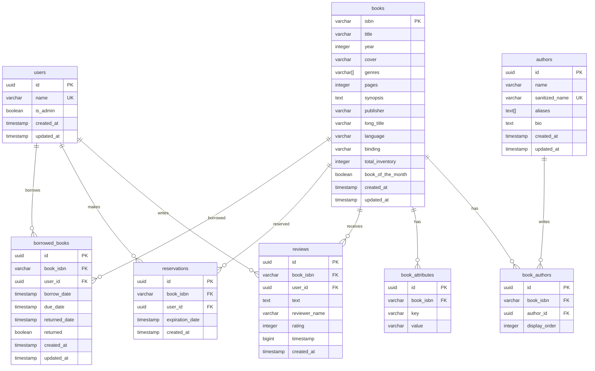

# Phase 1: Postgres ERD Design

This document presents the proposed PostgreSQL schema design for migrating from MongoDB. The design normalizes the data model, replaces MongoDB-specific patterns with relational equivalents, and adds proper foreign key constraints.

## Design Decisions

### Key Transformations

1. **ISBN as Primary Key**: Books retain ISBN as the primary key (VARCHAR) since it's a natural, immutable identifier.

2. **Polymorphic Pattern Resolution**: The `issueDetails` collection is split into two separate tables (`reservations` and `borrowed_books`) for cleaner schema and better type safety.

3. **Many-to-Many Relationships**: A junction table (`book_authors`) replaces the bidirectional embedded references between books and authors.

4. **Embedded Reviews**: Reviews are fully normalized into a separate table with proper foreign keys, removing the embedded subset pattern.

5. **Computed Fields**: The `available` field is implemented as a database view or can be computed via triggers for performance.

6. **Composite Keys**: Replaced with proper surrogate keys (UUID or SERIAL) with unique constraints on the business key combination.

## Entity Relationship Diagram (Mermaid)



## Detailed Table Schemas

### users

Stores library user information with validation constraints.

```sql
CREATE TABLE users (
    id UUID PRIMARY KEY DEFAULT gen_random_uuid(),
    name VARCHAR(255) NOT NULL,
    is_admin BOOLEAN NOT NULL DEFAULT FALSE,
    created_at TIMESTAMP WITH TIME ZONE DEFAULT CURRENT_TIMESTAMP,
    updated_at TIMESTAMP WITH TIME ZONE DEFAULT CURRENT_TIMESTAMP,
    
    CONSTRAINT users_name_min_length CHECK (LENGTH(name) >= 5),
    CONSTRAINT users_name_unique UNIQUE (name)
);

CREATE INDEX idx_users_name ON users(name);
CREATE INDEX idx_users_is_admin ON users(is_admin);
```

### authors

Stores author information with URL-friendly sanitized names.

```sql
CREATE TABLE authors (
    id UUID PRIMARY KEY DEFAULT gen_random_uuid(),
    name VARCHAR(255) NOT NULL,
    sanitized_name VARCHAR(255) NOT NULL,
    aliases TEXT[] DEFAULT '{}',
    bio TEXT,
    created_at TIMESTAMP WITH TIME ZONE DEFAULT CURRENT_TIMESTAMP,
    updated_at TIMESTAMP WITH TIME ZONE DEFAULT CURRENT_TIMESTAMP,
    
    CONSTRAINT authors_sanitized_name_unique UNIQUE (sanitized_name)
);

CREATE INDEX idx_authors_name ON authors(name);
CREATE INDEX idx_authors_sanitized_name ON authors(sanitized_name);
```

### books

Stores book catalog information using ISBN as the natural primary key.

```sql
CREATE TABLE books (
    isbn VARCHAR(20) PRIMARY KEY,
    title VARCHAR(500) NOT NULL,
    year INTEGER,
    cover VARCHAR(500),
    genres VARCHAR(100)[] DEFAULT '{}',
    pages INTEGER,
    synopsis TEXT,
    publisher VARCHAR(255),
    long_title VARCHAR(500),
    language VARCHAR(50),
    binding VARCHAR(50),
    total_inventory INTEGER NOT NULL DEFAULT 0,
    book_of_the_month BOOLEAN DEFAULT FALSE,
    created_at TIMESTAMP WITH TIME ZONE DEFAULT CURRENT_TIMESTAMP,
    updated_at TIMESTAMP WITH TIME ZONE DEFAULT CURRENT_TIMESTAMP,
    
    CONSTRAINT books_total_inventory_non_negative CHECK (total_inventory >= 0),
    CONSTRAINT books_pages_positive CHECK (pages IS NULL OR pages > 0),
    CONSTRAINT books_year_reasonable CHECK (year IS NULL OR (year > 0 AND year <= EXTRACT(YEAR FROM CURRENT_DATE) + 1))
);

CREATE INDEX idx_books_title ON books(title);
CREATE INDEX idx_books_year ON books(year);
CREATE INDEX idx_books_publisher ON books(publisher);
```

### book_authors (Junction Table)

Implements the many-to-many relationship between books and authors.

```sql
CREATE TABLE book_authors (
    id UUID PRIMARY KEY DEFAULT gen_random_uuid(),
    book_isbn VARCHAR(20) NOT NULL REFERENCES books(isbn) ON DELETE CASCADE,
    author_id UUID NOT NULL REFERENCES authors(id) ON DELETE CASCADE,
    display_order INTEGER DEFAULT 0,
    
    CONSTRAINT book_authors_unique UNIQUE (book_isbn, author_id)
);

CREATE INDEX idx_book_authors_book ON book_authors(book_isbn);
CREATE INDEX idx_book_authors_author ON book_authors(author_id);
```

### book_attributes

Stores flexible key-value attributes for books (attribute pattern).

```sql
CREATE TABLE book_attributes (
    id UUID PRIMARY KEY DEFAULT gen_random_uuid(),
    book_isbn VARCHAR(20) NOT NULL REFERENCES books(isbn) ON DELETE CASCADE,
    key VARCHAR(100) NOT NULL,
    value VARCHAR(500) NOT NULL,
    
    CONSTRAINT book_attributes_unique UNIQUE (book_isbn, key)
);

CREATE INDEX idx_book_attributes_book ON book_attributes(book_isbn);
CREATE INDEX idx_book_attributes_key ON book_attributes(key);
```

### reviews

Stores book reviews with proper foreign key relationships.

```sql
CREATE TABLE reviews (
    id UUID PRIMARY KEY DEFAULT gen_random_uuid(),
    book_isbn VARCHAR(20) NOT NULL REFERENCES books(isbn) ON DELETE CASCADE,
    user_id UUID REFERENCES users(id) ON DELETE SET NULL,
    text TEXT NOT NULL,
    reviewer_name VARCHAR(255) NOT NULL,
    rating INTEGER,
    timestamp BIGINT NOT NULL,
    created_at TIMESTAMP WITH TIME ZONE DEFAULT CURRENT_TIMESTAMP,
    
    CONSTRAINT reviews_rating_range CHECK (rating IS NULL OR (rating >= 1 AND rating <= 5))
);

CREATE INDEX idx_reviews_book ON reviews(book_isbn);
CREATE INDEX idx_reviews_user ON reviews(user_id);
CREATE INDEX idx_reviews_rating ON reviews(rating);
CREATE INDEX idx_reviews_timestamp ON reviews(timestamp DESC);
```

### reservations

Stores book reservations (split from polymorphic issueDetails).

```sql
CREATE TABLE reservations (
    id UUID PRIMARY KEY DEFAULT gen_random_uuid(),
    book_isbn VARCHAR(20) NOT NULL REFERENCES books(isbn) ON DELETE CASCADE,
    user_id UUID NOT NULL REFERENCES users(id) ON DELETE CASCADE,
    expiration_date TIMESTAMP WITH TIME ZONE NOT NULL,
    created_at TIMESTAMP WITH TIME ZONE DEFAULT CURRENT_TIMESTAMP,
    
    CONSTRAINT reservations_unique_active UNIQUE (book_isbn, user_id)
);

CREATE INDEX idx_reservations_book ON reservations(book_isbn);
CREATE INDEX idx_reservations_user ON reservations(user_id);
CREATE INDEX idx_reservations_expiration ON reservations(expiration_date);
```

### borrowed_books

Stores borrowed book records (split from polymorphic issueDetails).

```sql
CREATE TABLE borrowed_books (
    id UUID PRIMARY KEY DEFAULT gen_random_uuid(),
    book_isbn VARCHAR(20) NOT NULL REFERENCES books(isbn) ON DELETE CASCADE,
    user_id UUID NOT NULL REFERENCES users(id) ON DELETE CASCADE,
    borrow_date TIMESTAMP WITH TIME ZONE NOT NULL,
    due_date TIMESTAMP WITH TIME ZONE NOT NULL,
    returned_date TIMESTAMP WITH TIME ZONE,
    returned BOOLEAN NOT NULL DEFAULT FALSE,
    created_at TIMESTAMP WITH TIME ZONE DEFAULT CURRENT_TIMESTAMP,
    updated_at TIMESTAMP WITH TIME ZONE DEFAULT CURRENT_TIMESTAMP,
    
    CONSTRAINT borrowed_books_dates_valid CHECK (due_date > borrow_date),
    CONSTRAINT borrowed_books_returned_consistency CHECK (
        (returned = FALSE AND returned_date IS NULL) OR
        (returned = TRUE AND returned_date IS NOT NULL)
    )
);

CREATE INDEX idx_borrowed_books_book ON borrowed_books(book_isbn);
CREATE INDEX idx_borrowed_books_user ON borrowed_books(user_id);
CREATE INDEX idx_borrowed_books_returned ON borrowed_books(returned);
CREATE INDEX idx_borrowed_books_due_date ON borrowed_books(due_date);
CREATE INDEX idx_borrowed_books_active ON borrowed_books(book_isbn, user_id) WHERE returned = FALSE;
```

## Computed Available Field

The `available` field from MongoDB is computed dynamically. In PostgreSQL, this can be implemented as a view:

```sql
CREATE VIEW books_with_availability AS
SELECT 
    b.*,
    b.total_inventory - COALESCE(active_issues.count, 0) AS available
FROM books b
LEFT JOIN (
    SELECT book_isbn, COUNT(*) as count
    FROM (
        SELECT book_isbn FROM reservations
        UNION ALL
        SELECT book_isbn FROM borrowed_books WHERE returned = FALSE
    ) active
    GROUP BY book_isbn
) active_issues ON b.isbn = active_issues.book_isbn;
```

Alternatively, for performance-critical scenarios, a trigger-maintained column can be used:

```sql
ALTER TABLE books ADD COLUMN available INTEGER NOT NULL DEFAULT 0;

CREATE OR REPLACE FUNCTION update_book_availability()
RETURNS TRIGGER AS $$
BEGIN
    UPDATE books SET available = (
        SELECT total_inventory - (
            SELECT COUNT(*) FROM reservations WHERE book_isbn = NEW.book_isbn
        ) - (
            SELECT COUNT(*) FROM borrowed_books WHERE book_isbn = NEW.book_isbn AND returned = FALSE
        )
    ) WHERE isbn = NEW.book_isbn;
    RETURN NEW;
END;
$$ LANGUAGE plpgsql;

CREATE TRIGGER trg_reservation_availability
AFTER INSERT OR DELETE ON reservations
FOR EACH ROW EXECUTE FUNCTION update_book_availability();

CREATE TRIGGER trg_borrowed_availability
AFTER INSERT OR UPDATE OF returned ON borrowed_books
FOR EACH ROW EXECUTE FUNCTION update_book_availability();
```

## ID Mapping Table (for Migration)

To maintain referential integrity during migration, an ID mapping table tracks the relationship between MongoDB ObjectIds and PostgreSQL UUIDs:

```sql
CREATE TABLE migration_id_mapping (
    id SERIAL PRIMARY KEY,
    collection_name VARCHAR(50) NOT NULL,
    mongo_id VARCHAR(50) NOT NULL,
    postgres_id UUID NOT NULL,
    migrated_at TIMESTAMP WITH TIME ZONE DEFAULT CURRENT_TIMESTAMP,
    
    CONSTRAINT migration_id_mapping_unique UNIQUE (collection_name, mongo_id)
);

CREATE INDEX idx_migration_mapping_mongo ON migration_id_mapping(collection_name, mongo_id);
CREATE INDEX idx_migration_mapping_postgres ON migration_id_mapping(postgres_id);
```

## Schema Comparison Summary

| MongoDB Collection | PostgreSQL Table(s) | Key Changes |
|-------------------|---------------------|-------------|
| books | books, book_authors, book_attributes | Normalized authors to junction table, attributes to separate table |
| users | users | Added CHECK constraint for name length |
| issueDetails | reservations, borrowed_books | Split polymorphic collection into two tables |
| authors | authors, book_authors | Moved book references to junction table |
| reviews | reviews | Removed embedding, added proper foreign keys |
